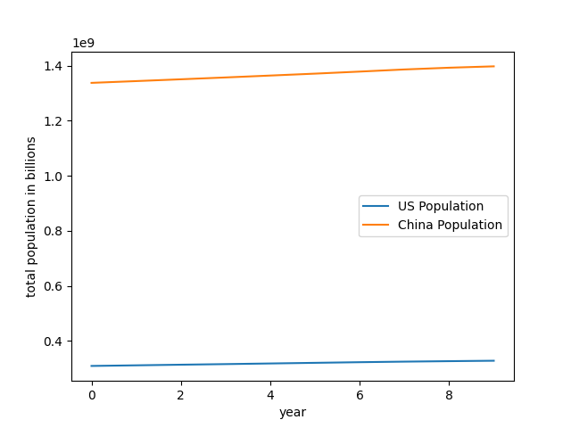
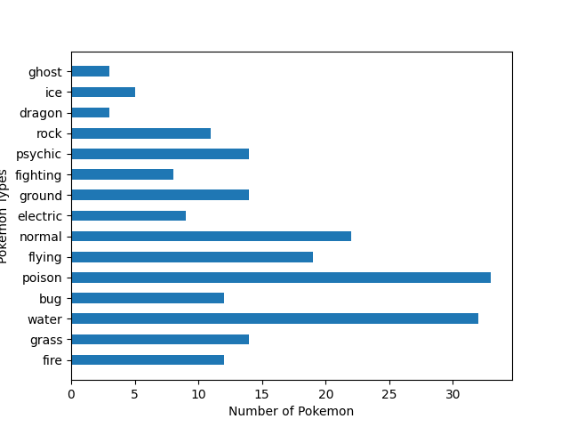

# HW2 Project
## Population of US vs China

<addr>
This graph shows how China's population has continued to have a larger population than that of the United States. Also, the graph shows how China's population is growing faster than that of the United States' as well.

### Original Dataset
<addr> The data used for this graph can be found [here](https://github.com/burningtree/awesome-json)

## Pokemon types

<addr> This graph shows the amount of **Generation I** Pokemon there are of each type. As we can see, some types of Pokemon, such as Water and Poison, are a lot more common than others, such as Ghost and Dragon.

### Interested in this Data?
<addr> The data used for this graph can be found [here](https://github.com/burningtree/awesome-json)

### Project Page: 

Check out this Github page to see the original Project instructions: [CMC-csci040's Homework 2](https://github.com/mikeizbicki/cmc-csci040/tree/2020fall/hw_02)
